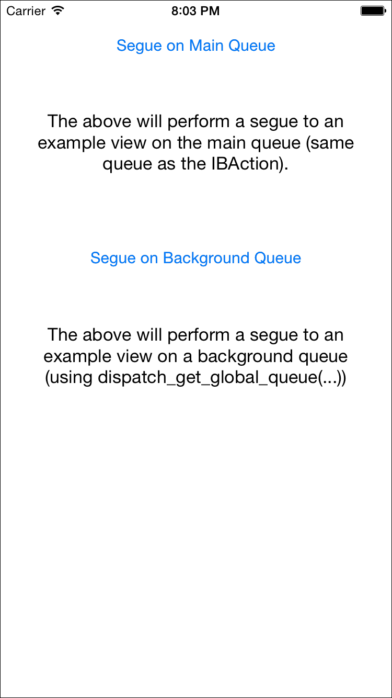
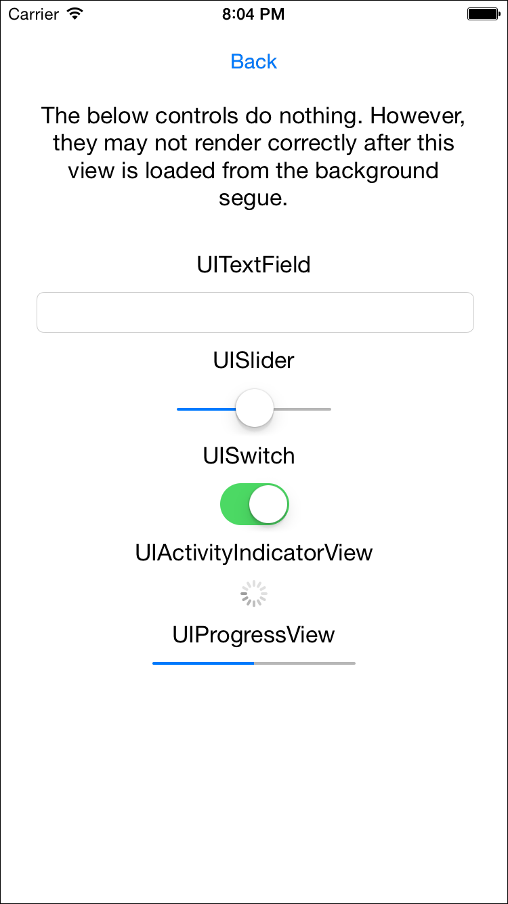
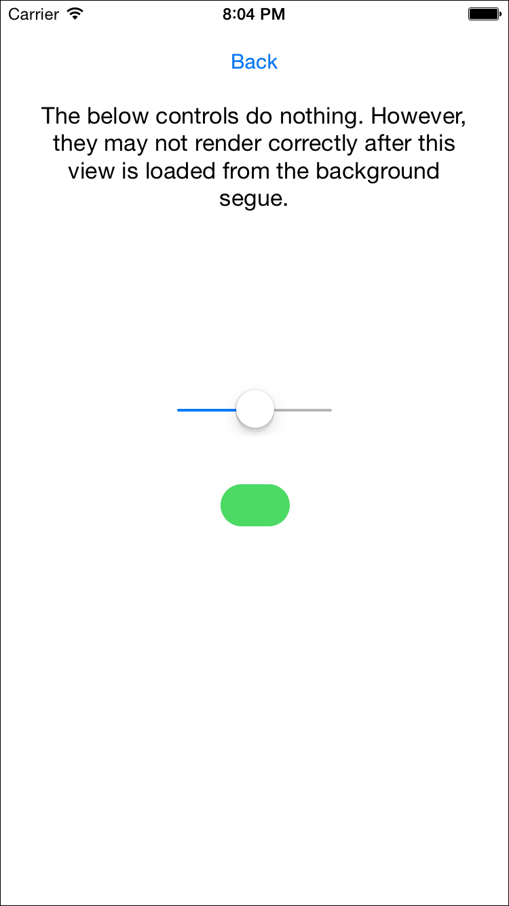

# iOSSegueQueueDemo

## Description

This project demonstrates some weird and rather annoying behaviour that you might see in an iOS project when you don't use queues properly.

## The Problem

UI operations in iOS are designed to be run on the "main" queue. If you get this wrong, it's often evident immediately: your labels don't update or other visible changes don't happen.

However, if you execute a segue on a non-UI thread, you can end up with some very weird and confusing behaviour without a clear idea of where the cause may lie.

## The Demonstration

If you open and run this project in the simulator, you will see a simple view with two buttons.

Click the top button and you will be taken to a view with a sampling of components.

From here, clicking back will take you to the original screen. Now, click the lower, "background queue" button.

Half of the components don't render correctly! This is an obvious example of the behaviour. However, the problem can also manifest in more subtle ways, such as the keyboard not rendering while remaining responsive to taps. 